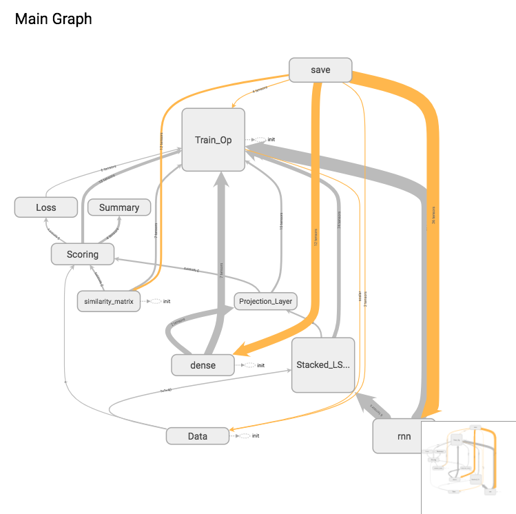
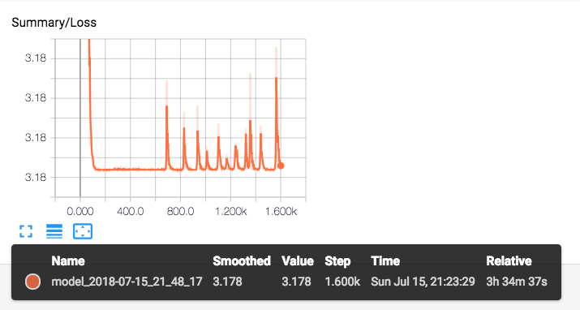
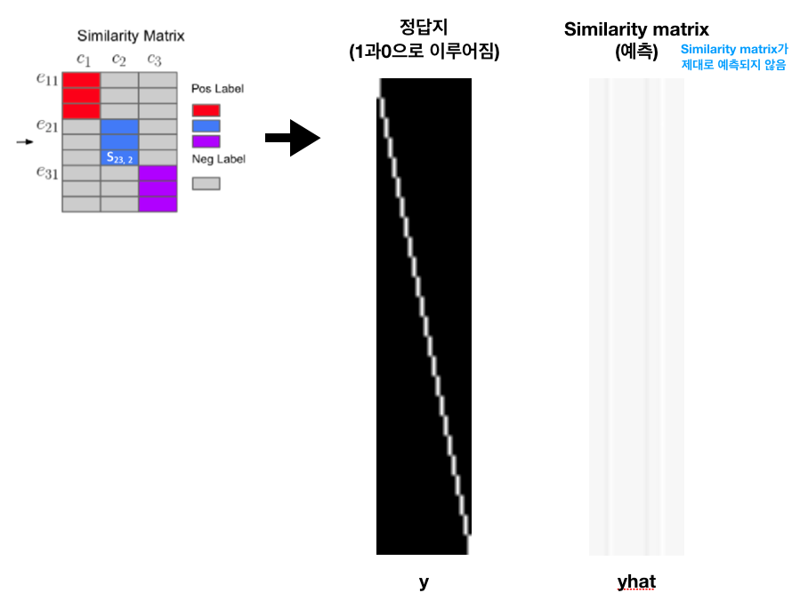

# Speaker verification using TIMIT

This project aimed to replicate "Generalized End-to-End Loss for Speaker Verification" (Wan et al., 2018) for TIMIT dataset.

Still in progress...

## Model

## Result

---

## TODO

- [] Consider negative samples computed in the similarity matrix
- [] Add validation code
- [] Add eval.py
- [] Fix centroid matrix visualization (projector in tensorboard)